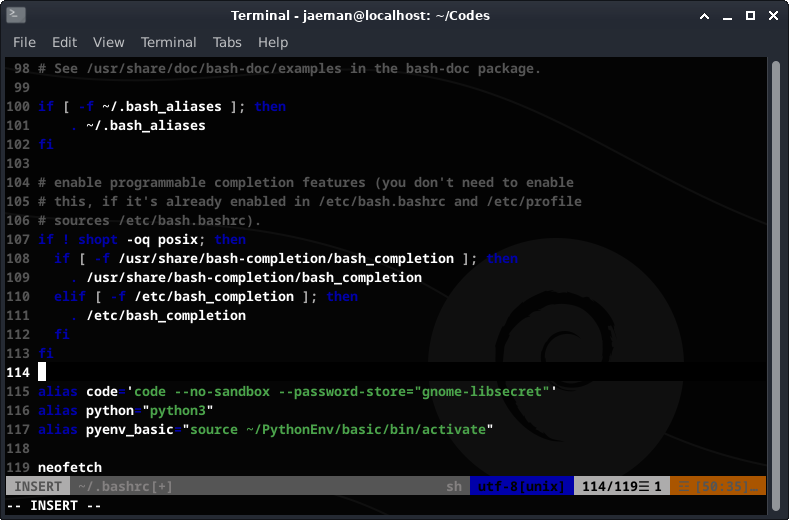
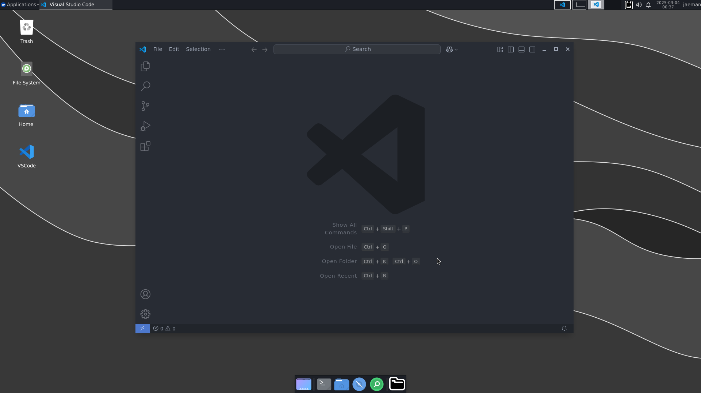

## Prerequisition
- Termux installed
- Linux GUI installed(Debian or Ubuntu)
- Browser Installed(recommend Firefox)

## Installation
Download VSCode from official website: https://code.visualstudio.com/download

> You should download arm-64 version of VSCode for Android Device
{: .prompt-info }

If downloaded, type following command in the terminal

```
sudo dpkg -i "{downloaded .dep file path}"
```
{:.language-bash}

You may type below to open VSCode in your xfce or KDE environment

```
code --no-sandbox
```
{:.language-bash}

but since the ```--no-sandbox``` option is not a default, we are not able to open vscode directly by click or command. we have to set it for easy-open.

## Settings for Easy-open VSCode

### Make a command alias
Open terminal

```
vi ~/.bashrc
```
{:.language-bash}
```.zshrc``` for oh-my-zsh user, bash is the default.\
paste the text to the end of file

```
alias code='code --no-sandbox'
```
{:.language-bash}

reload it

```
source ~/.bshrc
```
{:.language-bash}

## Install a kerying(for Xcfe-4 user, Optional)
KDE has the build-in keyring application called ```KWallet```.\
but xcfe desktop doesn't have any built-in kerying, so we need to install it for VSCode **Sign in**.\
<br>
Open the terminal

```
sudo apt install gnome-keyring
```
{:.language-bash}

Now we can open the VSCode using the keyring via

```
code --password-store="gnome-libsecret"
```
{:.language-bash}

combine with ```--no-sandbox``` option, apply it to the ```.bashrc``` file as described above.

*see line 115*

> While you Signing in with github, you may stuck in the redirection page. if so, click cancel in the VSCode loading block, and let it signin through localhost(it will suggest it when you cancel)
{: .prompt-warning }

for me, it happened both of KDE and Xcfe environment. 

## Make a desktop Shortcut
at the desktop.\
right click -> Create a Launcher\
fill as below:

- **Name:** VSCode
- **Command:** bash -c 'code --no-sandbox --password-store="gnome-libsecret"'
- **Icon:** double click the empty square to open icon-search box, and type 'code' to find VSCode icon

It makes a clickable VSCode icon in the desktop

## Result

Now we got a VSCode for Coding! enjoy it :D